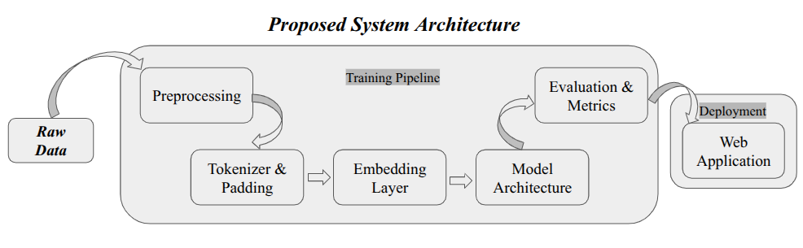

# A Comparative Evaluation of Recurrent Neural Networks, LSTMs, and GRUs for Real-Time Twitter Sentiment Classification

 

> A deep learning-based sentiment analysis study comparing Simple RNN, LSTM, and GRU architectures using pre-trained GloVe word embeddings.

---

## 📌 Overview

This project presents a comparative study of three recurrent neural network architectures for binary sentiment classification:

- **Simple Recurrent Neural Network (RNN)**
- **Long Short-Term Memory (LSTM)**
- **Gated Recurrent Unit (GRU)**

The study investigates how different recurrent architectures perform on sentiment classification when using the same general NLP pipeline and pre-trained **GloVe word embeddings**.

The project includes three experimental levels, covering model development, training, evaluation, visualization, and comparative analysis.

A separate web application has also been developed to provide real-time sentiment predictions using the trained models.

---

## 🎯 Research Objective

The main objective of this project is to investigate and compare the effectiveness of RNN, LSTM, and GRU architectures for sentiment analysis.

The study focuses on:

- Preparing textual data for deep learning-based sentiment classification.
- Representing text using pre-trained GloVe word embeddings.
- Developing three recurrent neural network architectures.
- Training and evaluating each architecture under the experimental setup.
- Comparing their classification performance.
- Analyzing prediction errors and model behavior.
- Developing a real-time application based on the trained models.

---

## 🔤 NLP Pipeline

The overall NLP and sentiment analysis workflow used in this study is illustrated below.

  

---

## 🧠 Models Studied

### Level 1 — Simple RNN

The first experimental level implements a standard recurrent neural network for sentiment classification.

The model establishes a baseline for evaluating the performance of more advanced recurrent architectures.

### Level 2 — LSTM

The second experimental level uses a Long Short-Term Memory network.

LSTM introduces memory cells and gating mechanisms designed to better handle dependencies across sequential input data.

### Level 3 — GRU

The third experimental level uses a Gated Recurrent Unit network.

GRU provides a gated recurrent architecture designed to capture sequential dependencies while using a simpler gating structure than LSTM.

---

---

## 📊 Evaluation

The models are evaluated using classification metrics and visualizations.

The evaluation includes:

- Accuracy
- Precision
- Recall
- F1-score
- Confusion matrix
- Training and validation performance
- Prediction analysis
- Error analysis

The final numerical results will be reported directly from the completed experiments.

---

## 📈 Experimental Results

The three models will be compared using the evaluation results obtained from the experiments.

### Performance Comparison

| Model | Test Accuracy | Test Loss | F1-Score |
|------|----------|-----------|----------|
| Simple RNN | 0.7573 | 0.4959 | — |
| LSTM | 0.7819 | 0.4573 | 0.7899 |
| GRU | 0.7811 | 0.4583 | 0.7874 |

> **Note:** Numerical values will be added after verifying the final experimental outputs.

---

## 🔎 Error Analysis

Error analysis is used to examine incorrect sentiment predictions and understand challenging cases.

The analysis focuses on:

- Misclassified examples
- Difficult textual patterns
- Differences between model predictions
- Potential sources of classification errors

Detailed findings will be documented based on the final experimental results.

---

## 🔬 Model Comparison

The three architectures are compared within a common experimental framework.

The comparison considers:

- Classification performance
- Training behavior
- Validation behavior
- Prediction errors
- Architectural characteristics
- Practical deployment considerations

A complete comparison will be presented after the final experimental results have been verified.

---
## 🌐 Web Application

A separate repository contains the deployment-oriented web application based on the trained models.

### 🧠 Sentiment Analyzer

The sentiment analyzer allows users to enter text and obtain sentiment predictions using the trained models.

Supported models: **Simple RNN** **LSTM** **GRU**

### Application Repository

**Coming Soon**

---

## 🛠️ Technologies

### Programming

- Python

### Deep Learning

- TensorFlow
- Keras

### Natural Language Processing

- NLP preprocessing
- Tokenization
- Sequence processing
- GloVe word embeddings

### Data Science

- NumPy
- Pandas
- Scikit-learn

### Visualization

- Matplotlib
- Seaborn

### Application Development

- Vue
- FastAPI

---

## 📚 Research Paper

This project is being developed as a research study to prepare an academic manuscript.

### Working Title

**A Comparative Evaluation of Recurrent Neural Networks, LSTMs, and GRUs for Real-Time Twitter Sentiment Classification**

### Preprint

**arXiv: Coming Soon**

---

## ⚠️ Limitations

The study's limitations will be discussed based on the experimental findings.

Potential considerations include:

- Dataset characteristics
- Dataset domain
- Dataset size
- Model architecture
- Experimental configuration
- Computational resources
- Generalization to other datasets

The final limitations will be determined from the completed experiments.

---
---

## 👨‍💻 Author

**Rabby Md Golam**

Artificial Intelligence Undergraduate  
Yunnan University, China

### Connect

- GitHub: [Rabby0501](https://github.com/Rabby0501)
- LinkedIn: [Golam Rabby](https://linkedin.com/in/golamrabby05)

---

## 📄 License

This project is intended for academic and research purposes.

The final repository license will be specified here.

---

## ⭐ Acknowledgements

This project makes use of open-source machine learning, deep learning, and natural language processing technologies, as well as publicly available resources.

All datasets, libraries, and research works used in the project will be appropriately acknowledged and cited.

---
